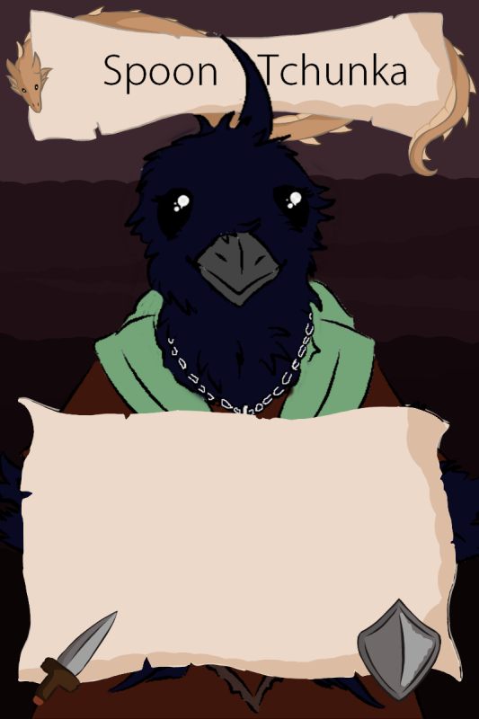
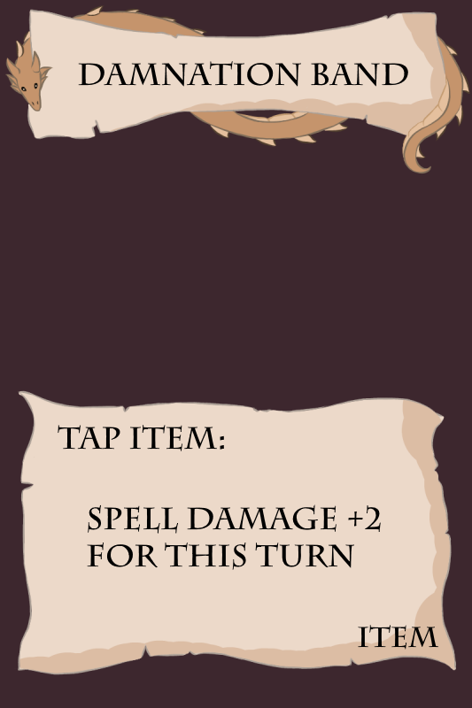
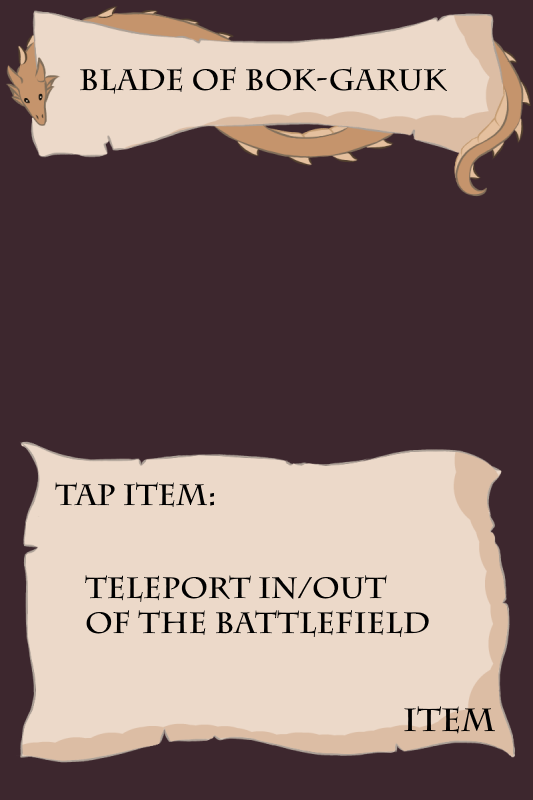
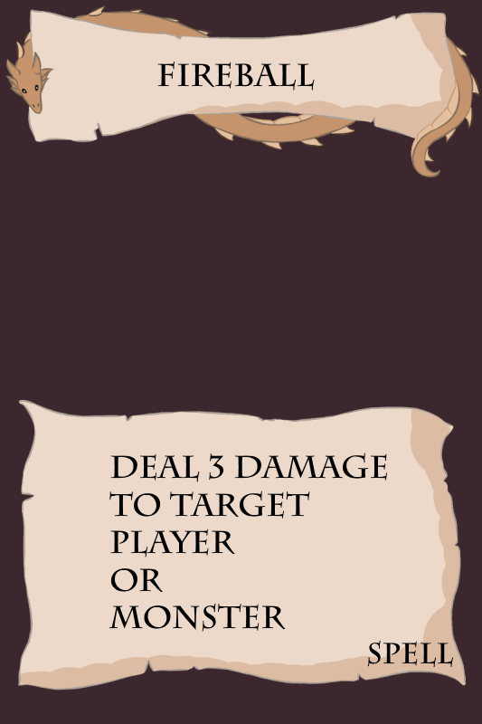

Hello! My name is Jacob (Jake) and I am a student at the University of Hull studying Computer Science.
Over the time I have spent with the University of Hull I have worked on several projects both
for the University and also as personal projects.

## 3D Lighting:

 

Here is a video demo of the 3D Lighting project.

<iframe width="560" height="315" src="https://www.youtube.com/embed/THPk8BGfypQ" frameborder="0" allow="accelerometer; autoplay; encrypted-media; gyroscope; picture-in-picture" allowfullscreen></iframe>

## 3D Dungeon:

 

Here is a video demo of the 3D Dungeon project.

<iframe width="560" height="315" src="https://www.youtube.com/embed/AbW8nn6e33g" frameborder="0" allow="accelerometer; autoplay; encrypted-media; gyroscope; picture-in-picture" allowfullscreen></iframe>

## 3D Pacman:

 

Here is a video demo of my 3D Pacman game.

<iframe width="560" height="315" src="https://www.youtube.com/embed/jwVj4e4HU9E" frameborder="0" allow="accelerometer; autoplay; encrypted-media; gyroscope; picture-in-picture" allowfullscreen></iframe>

## 2D Simulation:

Click the image to see it in action!

.

As a piece of coursework i was tasked with creating a 2D simulation with basic physics.

## DnD Initiative Calculator:

## Other Projects:

These are some other non-programming projects that i pursue mainly out of an interest and love for them.

### Youtube Channel:

I do run a youtube channel and create video reviews of video games for fun. This is mostly because of a love of video editing that I have,
and scince finishign at college and not doing Creative Media anymore, i felt a need to scratch the video editing itch that it left me with.

 <a href="https://www.youtube.com/channel/UCo9LstsNtOA1EngX57YISyQ">My channel can be found here!</a> 

### Card Game:

For as long as i can remember i have loved board games, growing up playing Cluedo with my family, i also played a lot of the Pokemon trading card game
and as i became a teenager i discovered Magic the Gathering that i still play to this day. And so because of this i have always wanted to create my own 
card game that people could enjoy as much as i did as a child.

####The Seven Snakes VS Giants:

This is a card game i have been slowly working on in my free time based on a Dungeons and Dragons campaign that me and my friends played, where the character cards
are our characters. I have created a digital mock up of the card game that is playable on Tabletop Simulator, and after i gather up enough art assets i intend on having
this be printed and published.

    