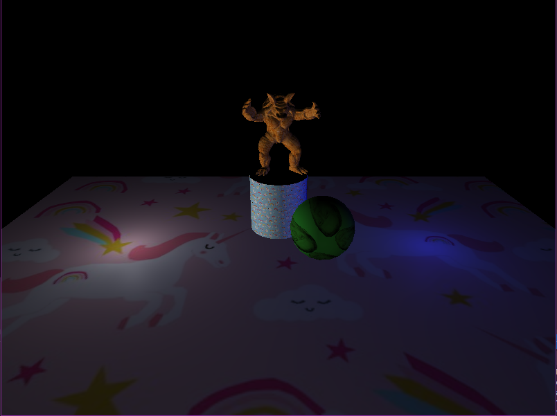
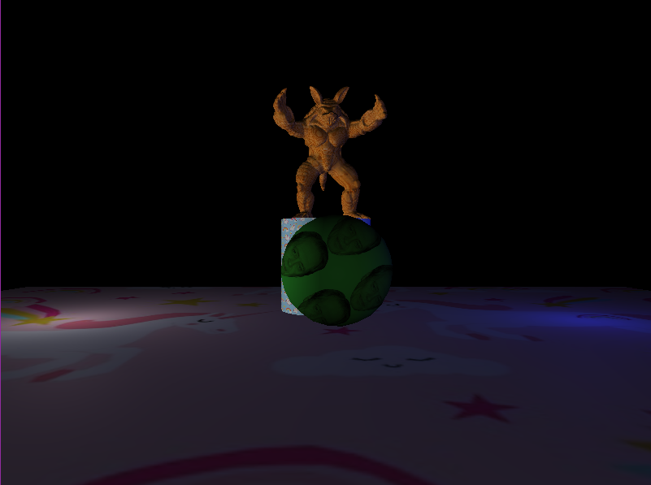
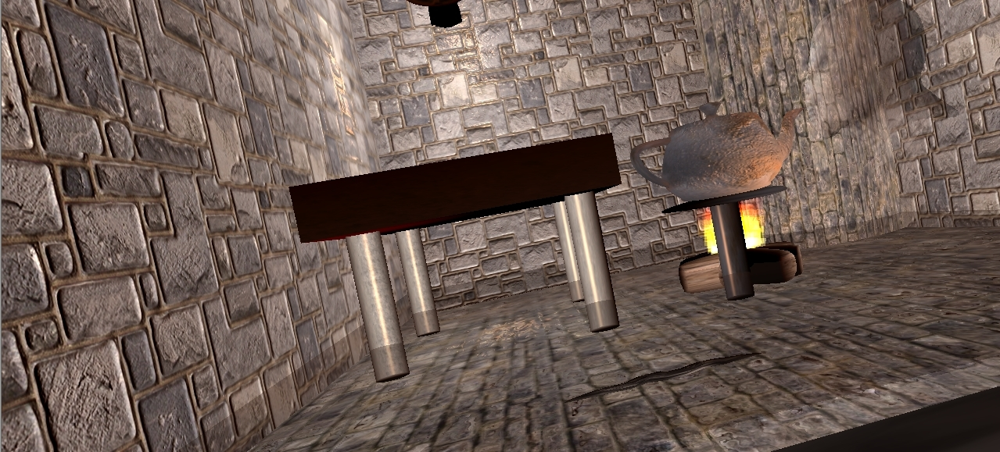
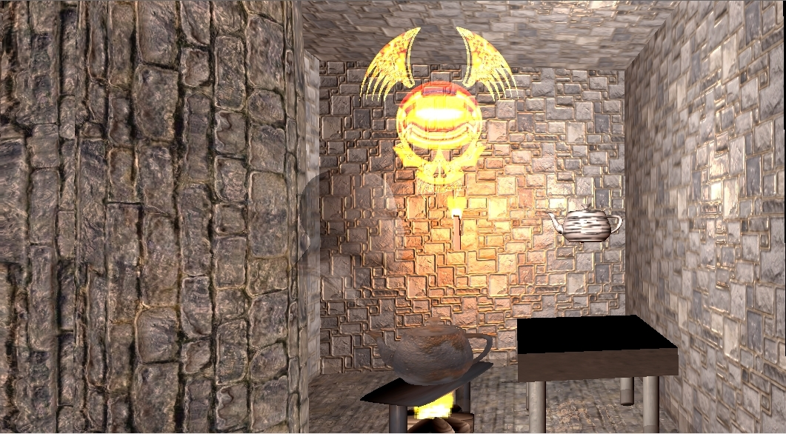
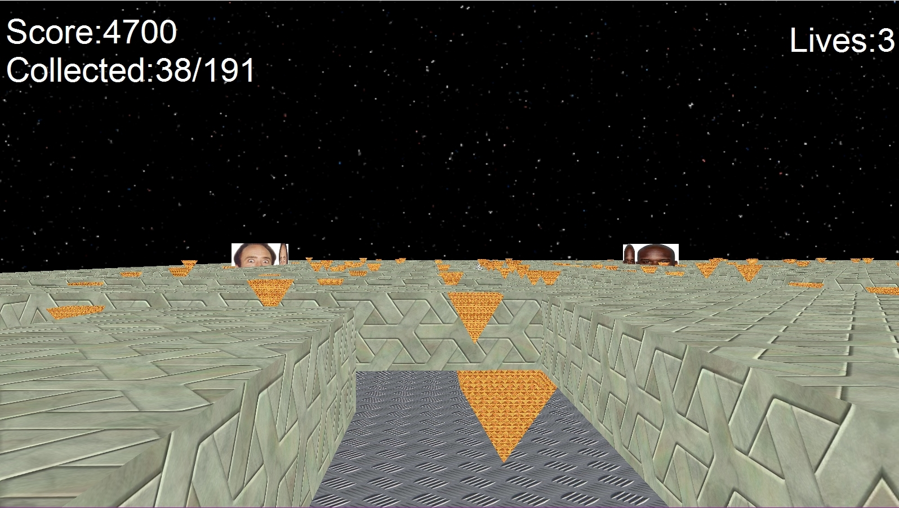
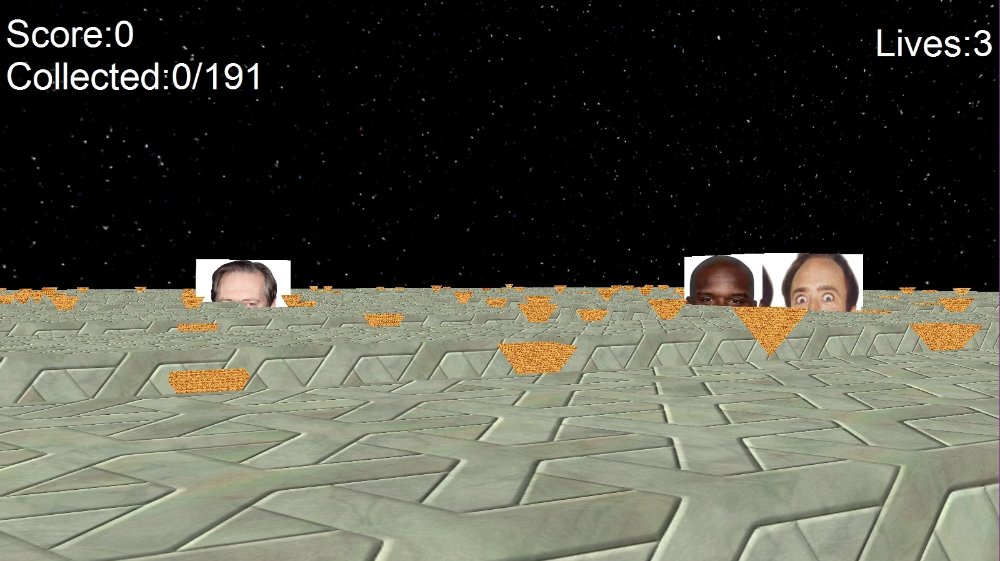
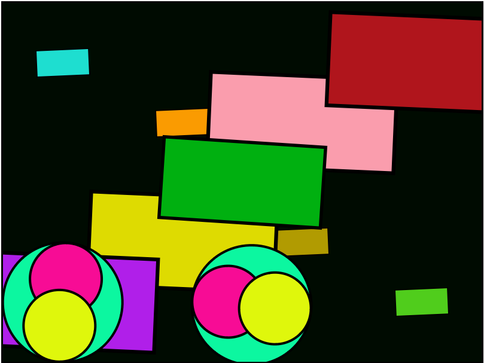

Hello! My name is Jacob (Jake) and i am a student at the University of Hull studying Computer Science.
Over the time i have spent with the University of Hull i have worked on several projects both
for the University and also as personal projects.

3D Lighting:

Here is a video demo of the 3D Lighting project.

<iframe width="560" height="315" src="https://www.youtube.com/embed/THPk8BGfypQ" frameborder="0" allow="accelerometer; autoplay; encrypted-media; gyroscope; picture-in-picture" allowfullscreen></iframe>

3D Dungeon:

Here is a video demo of the 3D Dungeon project.

<iframe width="560" height="315" src="https://www.youtube.com/embed/AbW8nn6e33g" frameborder="0" allow="accelerometer; autoplay; encrypted-media; gyroscope; picture-in-picture" allowfullscreen></iframe>

3D Pacman:

Here is a video demo of my 3D Pacman game.

<iframe width="560" height="315" src="https://www.youtube.com/embed/jwVj4e4HU9E" frameborder="0" allow="accelerometer; autoplay; encrypted-media; gyroscope; picture-in-picture" allowfullscreen></iframe>

2D Simulation:

As a piece of coursework i was tasked with creating a 2D simulation with basic physics.
[That can be found here!](./2D/index.html).

DnD Initiative Calculator:

